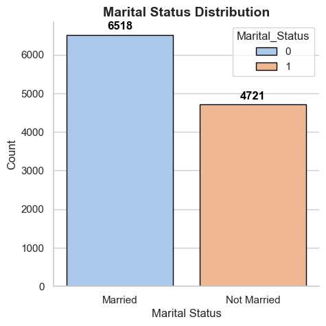
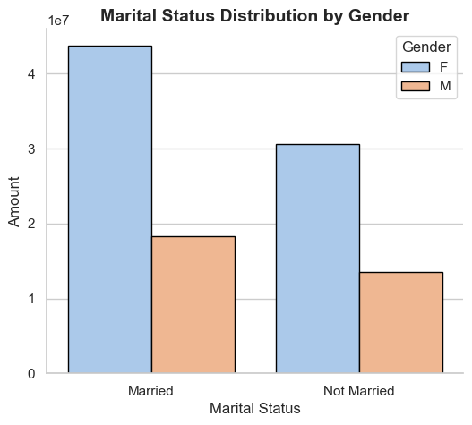

# Diwali Sales Analysis

---

```python
import numpy as np
import pandas as pd
import matplotlib.pyplot as plt
%matplotlib inline
import seaborn as sns
sns.set_theme(style="whitegrid")
```

## Data Cleaning

```python
df = pd.read_csv("Diwali Sales Data.csv", encoding='unicode_escape')
```

```python
df.head()
```

<div>
<style scoped>
    .dataframe tbody tr th:only-of-type {
        vertical-align: middle;
    }

    .dataframe tbody tr th {
        vertical-align: top;
    }

    .dataframe thead th {
        text-align: right;
    }

</style>
<table border="1" class="dataframe">
  <thead>
    <tr style="text-align: right;">
      <th></th>
      <th>User_ID</th>
      <th>Cust_name</th>
      <th>Product_ID</th>
      <th>Gender</th>
      <th>Age Group</th>
      <th>Age</th>
      <th>Marital_Status</th>
      <th>State</th>
      <th>Zone</th>
      <th>Occupation</th>
      <th>Product_Category</th>
      <th>Orders</th>
      <th>Amount</th>
      <th>Status</th>
      <th>unnamed1</th>
    </tr>
  </thead>
  <tbody>
    <tr>
      <th>0</th>
      <td>1002903</td>
      <td>Sanskriti</td>
      <td>P00125942</td>
      <td>F</td>
      <td>26-35</td>
      <td>28</td>
      <td>0</td>
      <td>Maharashtra</td>
      <td>Western</td>
      <td>Healthcare</td>
      <td>Auto</td>
      <td>1</td>
      <td>23952.0</td>
      <td>NaN</td>
      <td>NaN</td>
    </tr>
    <tr>
      <th>1</th>
      <td>1000732</td>
      <td>Kartik</td>
      <td>P00110942</td>
      <td>F</td>
      <td>26-35</td>
      <td>35</td>
      <td>1</td>
      <td>Andhra Pradesh</td>
      <td>Southern</td>
      <td>Govt</td>
      <td>Auto</td>
      <td>3</td>
      <td>23934.0</td>
      <td>NaN</td>
      <td>NaN</td>
    </tr>
    <tr>
      <th>2</th>
      <td>1001990</td>
      <td>Bindu</td>
      <td>P00118542</td>
      <td>F</td>
      <td>26-35</td>
      <td>35</td>
      <td>1</td>
      <td>Uttar Pradesh</td>
      <td>Central</td>
      <td>Automobile</td>
      <td>Auto</td>
      <td>3</td>
      <td>23924.0</td>
      <td>NaN</td>
      <td>NaN</td>
    </tr>
    <tr>
      <th>3</th>
      <td>1001425</td>
      <td>Sudevi</td>
      <td>P00237842</td>
      <td>M</td>
      <td>0-17</td>
      <td>16</td>
      <td>0</td>
      <td>Karnataka</td>
      <td>Southern</td>
      <td>Construction</td>
      <td>Auto</td>
      <td>2</td>
      <td>23912.0</td>
      <td>NaN</td>
      <td>NaN</td>
    </tr>
    <tr>
      <th>4</th>
      <td>1000588</td>
      <td>Joni</td>
      <td>P00057942</td>
      <td>M</td>
      <td>26-35</td>
      <td>28</td>
      <td>1</td>
      <td>Gujarat</td>
      <td>Western</td>
      <td>Food Processing</td>
      <td>Auto</td>
      <td>2</td>
      <td>23877.0</td>
      <td>NaN</td>
      <td>NaN</td>
    </tr>
  </tbody>
</table>
</div>

```python
df.info()
```

    <class 'pandas.core.frame.DataFrame'>
    RangeIndex: 11251 entries, 0 to 11250
    Data columns (total 15 columns):
     #   Column            Non-Null Count  Dtype
    ---  ------            --------------  -----
     0   User_ID           11251 non-null  int64
     1   Cust_name         11251 non-null  object
     2   Product_ID        11251 non-null  object
     3   Gender            11251 non-null  object
     4   Age Group         11251 non-null  object
     5   Age               11251 non-null  int64
     6   Marital_Status    11251 non-null  int64
     7   State             11251 non-null  object
     8   Zone              11251 non-null  object
     9   Occupation        11251 non-null  object
     10  Product_Category  11251 non-null  object
     11  Orders            11251 non-null  int64
     12  Amount            11239 non-null  float64
     13  Status            0 non-null      float64
     14  unnamed1          0 non-null      float64
    dtypes: float64(3), int64(4), object(8)
    memory usage: 1.3+ MB

```python
df.drop(['Status', 'unnamed1'], axis=1, inplace=True)
```

```python
df.head()
```

<div>
<style scoped>
    .dataframe tbody tr th:only-of-type {
        vertical-align: middle;
    }

    .dataframe tbody tr th {
        vertical-align: top;
    }

    .dataframe thead th {
        text-align: right;
    }

</style>
<table border="1" class="dataframe">
  <thead>
    <tr style="text-align: right;">
      <th></th>
      <th>User_ID</th>
      <th>Cust_name</th>
      <th>Product_ID</th>
      <th>Gender</th>
      <th>Age Group</th>
      <th>Age</th>
      <th>Marital_Status</th>
      <th>State</th>
      <th>Zone</th>
      <th>Occupation</th>
      <th>Product_Category</th>
      <th>Orders</th>
      <th>Amount</th>
    </tr>
  </thead>
  <tbody>
    <tr>
      <th>0</th>
      <td>1002903</td>
      <td>Sanskriti</td>
      <td>P00125942</td>
      <td>F</td>
      <td>26-35</td>
      <td>28</td>
      <td>0</td>
      <td>Maharashtra</td>
      <td>Western</td>
      <td>Healthcare</td>
      <td>Auto</td>
      <td>1</td>
      <td>23952.0</td>
    </tr>
    <tr>
      <th>1</th>
      <td>1000732</td>
      <td>Kartik</td>
      <td>P00110942</td>
      <td>F</td>
      <td>26-35</td>
      <td>35</td>
      <td>1</td>
      <td>Andhra Pradesh</td>
      <td>Southern</td>
      <td>Govt</td>
      <td>Auto</td>
      <td>3</td>
      <td>23934.0</td>
    </tr>
    <tr>
      <th>2</th>
      <td>1001990</td>
      <td>Bindu</td>
      <td>P00118542</td>
      <td>F</td>
      <td>26-35</td>
      <td>35</td>
      <td>1</td>
      <td>Uttar Pradesh</td>
      <td>Central</td>
      <td>Automobile</td>
      <td>Auto</td>
      <td>3</td>
      <td>23924.0</td>
    </tr>
    <tr>
      <th>3</th>
      <td>1001425</td>
      <td>Sudevi</td>
      <td>P00237842</td>
      <td>M</td>
      <td>0-17</td>
      <td>16</td>
      <td>0</td>
      <td>Karnataka</td>
      <td>Southern</td>
      <td>Construction</td>
      <td>Auto</td>
      <td>2</td>
      <td>23912.0</td>
    </tr>
    <tr>
      <th>4</th>
      <td>1000588</td>
      <td>Joni</td>
      <td>P00057942</td>
      <td>M</td>
      <td>26-35</td>
      <td>28</td>
      <td>1</td>
      <td>Gujarat</td>
      <td>Western</td>
      <td>Food Processing</td>
      <td>Auto</td>
      <td>2</td>
      <td>23877.0</td>
    </tr>
  </tbody>
</table>
</div>

```python
pd.isnull(df).sum()
```

    User_ID              0
    Cust_name            0
    Product_ID           0
    Gender               0
    Age Group            0
    Age                  0
    Marital_Status       0
    State                0
    Zone                 0
    Occupation           0
    Product_Category     0
    Orders               0
    Amount              12
    dtype: int64

```python
df.dropna(inplace=True)
```

```python
pd.isnull(df).sum()
```

    User_ID             0
    Cust_name           0
    Product_ID          0
    Gender              0
    Age Group           0
    Age                 0
    Marital_Status      0
    State               0
    Zone                0
    Occupation          0
    Product_Category    0
    Orders              0
    Amount              0
    dtype: int64

```python
df['Amount'] = df['Amount'].astype(int)
```

```python
df.columns
```

    Index(['User_ID', 'Cust_name', 'Product_ID', 'Gender', 'Age Group', 'Age',
           'Marital_Status', 'State', 'Zone', 'Occupation', 'Product_Category',
           'Orders', 'Amount'],
          dtype='object')

```python
df[['Age', 'Orders', 'Amount']].describe()
```

<div>
<style scoped>
    .dataframe tbody tr th:only-of-type {
        vertical-align: middle;
    }

    .dataframe tbody tr th {
        vertical-align: top;
    }

    .dataframe thead th {
        text-align: right;
    }

</style>
<table border="1" class="dataframe">
  <thead>
    <tr style="text-align: right;">
      <th></th>
      <th>Age</th>
      <th>Orders</th>
      <th>Amount</th>
    </tr>
  </thead>
  <tbody>
    <tr>
      <th>count</th>
      <td>11239.000000</td>
      <td>11239.000000</td>
      <td>11239.000000</td>
    </tr>
    <tr>
      <th>mean</th>
      <td>35.410357</td>
      <td>2.489634</td>
      <td>9453.610553</td>
    </tr>
    <tr>
      <th>std</th>
      <td>12.753866</td>
      <td>1.114967</td>
      <td>5222.355168</td>
    </tr>
    <tr>
      <th>min</th>
      <td>12.000000</td>
      <td>1.000000</td>
      <td>188.000000</td>
    </tr>
    <tr>
      <th>25%</th>
      <td>27.000000</td>
      <td>2.000000</td>
      <td>5443.000000</td>
    </tr>
    <tr>
      <th>50%</th>
      <td>33.000000</td>
      <td>2.000000</td>
      <td>8109.000000</td>
    </tr>
    <tr>
      <th>75%</th>
      <td>43.000000</td>
      <td>3.000000</td>
      <td>12675.000000</td>
    </tr>
    <tr>
      <th>max</th>
      <td>92.000000</td>
      <td>4.000000</td>
      <td>23952.000000</td>
    </tr>
  </tbody>
</table>
</div>

---

## EDA

### Gender

- Plotting a bar graph for Gender

```python
plt.figure(figsize=(6, 4))
ax = sns.countplot(x="Gender", data=df, palette="pastel", edgecolor="black", hue="Gender")

for bars in ax.containers:
    ax.bar_label(bars, fmt="%d", padding=3, fontsize=12, color="black", weight="bold")

plt.title("Gender Count", fontsize=14, fontweight="bold")
plt.xlabel("Gender", fontsize=12)
plt.ylabel("Count", fontsize=12)

```


- Plotting a bar graph for Gender vs Total Amount

```python
plt.figure(figsize=(6, 4))
sales_gen = df.groupby(['Gender'], as_index = False)['Amount'].sum().sort_values(by='Amount', ascending=False)

sns.barplot(x = 'Gender', y = 'Amount', data=sales_gen, palette="pastel", edgecolor="black", hue="Gender")

plt.title("Gender Count", fontsize=14, fontweight="bold")
plt.xlabel("Gender", fontsize=12)
plt.ylabel("Count", fontsize=12)
```


- From above graphs we can see that most of the buyers are \*\*females and even the purchasing power of females are greater than men

### Age

```python
plt.figure(figsize=(8, 5))
ax = sns.countplot(x="Age Group", hue="Gender", data=df, palette="pastel", edgecolor="black")

for bars in ax.containers:
    ax.bar_label(bars, fmt="%d", padding=3, fontsize=12, color="black", weight="bold")

plt.title("Age Group Distribution by Gender", fontsize=14, fontweight="bold")
plt.xlabel("Age Group", fontsize=12)
plt.ylabel("Count", fontsize=12)

plt.legend(title="Gender", fontsize=10, title_fontsize=12)

sns.despine()
```


- Total Amount vs Age Group

```python
sales_age = df.groupby(['Age Group'], as_index=False)['Amount'].sum().sort_values(by='Amount', ascending=False)

sns.barplot(x='Age Group', y='Amount', data=sales_age, palette="pastel", edgecolor="black", hue='Amount')

plt.title("Age Group Distribution by Gender", fontsize=14, fontweight="bold")
plt.xlabel("Age Group", fontsize=12)
plt.ylabel("Count", fontsize=12)

plt.legend(title="Amount", fontsize=10, title_fontsize=12)

sns.despine()
```


- From above graphs we can see that most of the buyers are of age group between _26-35_ years female

### State

- Total number of orders from top 10 states

```python
sales_state = df.groupby(['State'], as_index=False)['Orders'].sum().sort_values(by='Orders', ascending=False).head(10)

plt.figure(figsize=(15, 5))
ax = sns.barplot(data=sales_state, x='State', y='Orders', palette="viridis", edgecolor="black", hue='State')

for bars in ax.containers:
    ax.bar_label(bars, fmt="%d", padding=3, fontsize=12, color="black", weight="bold")

plt.title("Top 10 States by Number of Orders", fontsize=16, fontweight="bold")
plt.xlabel("State", fontsize=14)
plt.ylabel("Total Orders", fontsize=14)

plt.xticks(rotation=45, ha="right", fontsize=12)

sns.despine()
```


- Total amount/sales from top 10 states

```python
sales_state = df.groupby(['State'], as_index=False)['Amount'].sum().sort_values(by='Amount', ascending=False).head(10)

ax = sns.barplot(data = sales_state, x = 'State',y= 'Amount', palette="viridis", edgecolor="black", hue="State")

for bars in ax.containers:
    ax.bar_label(bars, fmt="%d", padding=3, fontsize=12, color="black", weight="bold")

plt.title("Top 10 States by Number of Orders", fontsize=16, fontweight="bold")
plt.xlabel("State", fontsize=14)
plt.ylabel("Total Orders", fontsize=14)

plt.xticks(rotation=45, ha="right", fontsize=12)

sns.despine()
```


- From above graphs we can see that most of the orders & total sales/amount are from **Uttar Pradesh, Maharashtra** and **Karnataka** respectively

### Marital Status

```python
plt.figure(figsize=(5, 5))
ax = sns.countplot(data=df, x='Marital_Status', palette="pastel", edgecolor="black", hue="Marital_Status")

for bars in ax.containers:
    ax.bar_label(bars, fmt="%d", padding=3, fontsize=12, color="black", weight="bold")

ax.set_xticks([0, 1])
ax.set_xticklabels(["Married", "Not Married"])
plt.title("Marital Status Distribution", fontsize=14, fontweight="bold")
plt.xlabel("Marital Status", fontsize=12)
plt.ylabel("Count", fontsize=12)

sns.despine()
```



```python
plt.figure(figsize=(6, 5))

sales_state = df.groupby(['Marital_Status', 'Gender'], as_index=False)['Amount'].sum().sort_values(by='Amount', ascending=False)

ax = sns.barplot(data=sales_state, x='Marital_Status', y='Amount', hue='Gender', palette="pastel", edgecolor="black")

ax.set_xticks([0, 1])
ax.set_xticklabels(["Married", "Not Married"])
plt.title("Marital Status Distribution by Gender", fontsize=14, fontweight="bold")
plt.xlabel("Marital Status", fontsize=12)
plt.ylabel("Amount", fontsize=12)

sns.despine()
```



- From above graphs we can see that most of the buyers are **married (women)** and they have high purchasing power

### Occupation

```python
plt.figure(figsize=(20, 5))

ax = sns.countplot(data=df, x='Occupation', palette="pastel", edgecolor="black", hue="Occupation")

for bars in ax.containers:
    ax.bar_label(bars, fmt="%d", padding=3, fontsize=12, color="black", weight="bold")

plt.title("Occupation Distribution", fontsize=16, fontweight="bold")
plt.xlabel("Occupation", fontsize=14)
plt.ylabel("Count", fontsize=14)

plt.xticks(rotation=45, ha="right", fontsize=12)

sns.despine()
```


```python
sales_state = df.groupby(['Occupation'], as_index=False)['Amount'].sum().sort_values(by='Amount', ascending=False)

sns.set(rc={'figure.figsize':(20,5)})
sns.barplot(data = sales_state, x = 'Occupation',y= 'Amount',  palette="pastel", edgecolor="black", hue="Occupation")

plt.title("Occupation Distribution", fontsize=16, fontweight="bold")
plt.xlabel("Occupation", fontsize=14)
plt.ylabel("Count", fontsize=14)

plt.xticks(rotation=45, ha="right", fontsize=12)

sns.despine()
```


- From above graphs we can see that most of the buyers are working in **IT, Healthcare** and **Aviation** sector.

### Product Category

```python
plt.figure(figsize=(20, 5))

ax = sns.countplot(data = df, x = 'Product_Category', palette="pastel", edgecolor="black", hue='Product_Category', legend=False)

for bars in ax.containers:
    ax.bar_label(bars, fmt="%d", padding=3, fontsize=12, color="black", weight="bold")

plt.title("Occupation Distribution", fontsize=16, fontweight="bold")
plt.xlabel("Occupation", fontsize=14)
plt.ylabel("Count", fontsize=14)

plt.xticks(rotation=45, ha="right", fontsize=12)

sns.despine()
```


```python
sns.set(rc={'figure.figsize':(20,5)})

sales_state = df.groupby(['Product_Category'], as_index=False)['Amount'].sum().sort_values(by='Amount', ascending=False).head(10)

sns.barplot(data = sales_state, x = 'Product_Category',y= 'Amount', palette="pastel", edgecolor="black", hue='Product_Category', legend=False)

plt.title("Occupation Distribution", fontsize=16, fontweight="bold")
plt.xlabel("Occupation", fontsize=14)
plt.ylabel("Count", fontsize=14)

plt.xticks(rotation=45, ha="right", fontsize=12)

sns.despine()
```


- Top 10 most sold products

```python
sns.set(rc={'figure.figsize':(20,5)})

sales_state = df.groupby(['Product_ID'], as_index=False)['Orders'].sum().sort_values(by='Orders', ascending=False).head(10)

sns.barplot(data = sales_state, x = 'Product_ID',y= 'Orders', palette="pastel", edgecolor="black", hue='Product_ID', legend=False)

plt.title("Occupation Distribution", fontsize=16, fontweight="bold")
plt.xlabel("Occupation", fontsize=14)
plt.ylabel("Count", fontsize=14)

plt.xticks(rotation=45, ha="right", fontsize=12)

sns.despine()
```


## Conclusion

Married women age group 26-35 yrs from UP, Maharastra and Karnataka working in IT, Healthcare and Aviation are more likely to buy products from Food, Clothing and Electronics category

---

## 🫱🏻‍🫲🏻 Connect With Me

- Portfolio: <a href="https://hdzala.vercel.app/?ref=github" target="_blank">Portfolio</a>
- Other Projects: <a href="https://hdz-projectvault.vercel.app/" target="_blank">Project Vault</a>
- Github: <a href="https://github.com/hdz-088" target="_blank">HDz-088</a>
- Email: <a href="mailto:hdz088@outlook.com">hdz088@outlook.com</a>
- Instagram: <a href="https://instagram.com/hdz_088" target="_blank">hdz_088</a>
- LinkedIn: <a href="https://linkedin.com/in/hdz088/" target="_blank">hdz088</a>
